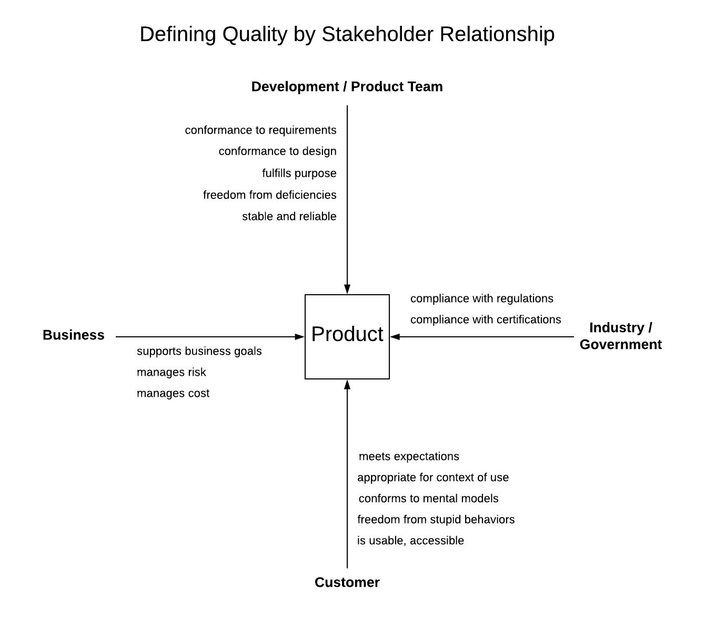

# quality-diagram
The windmill diagram for describing how to define quality based on stakeholder relationship to a software product.

## Description
This diagram has the software product at its center; at the top, bottom, left, and right edges of the diagrams are labels for the four stakeholder groups that drive the definitions of quality. These groups are:
+ the development team or product team
+ the customers
+ the business entity
+ the government and the relevant industry groups or industry governing bodies

These four stakeholders are connected by meaningful axes: the development/product team is connected to the customers, and the business enity is connected to the government/industry.

Examples of stakeholder-specific quality definitions are listed along the axis connecting stakeholder to product.

## Latest Version

## Project Structure
The latest version of this diagram is in the project root as `quality_windmill.png`. Older versions are in the `old` folder, with the current version having the latest version number in the filename.

## License
This project and files are &copy; Derek Sisson. Feel free to use this diagram, improve it (and please let me know), just give me attribution if you write about it. 
